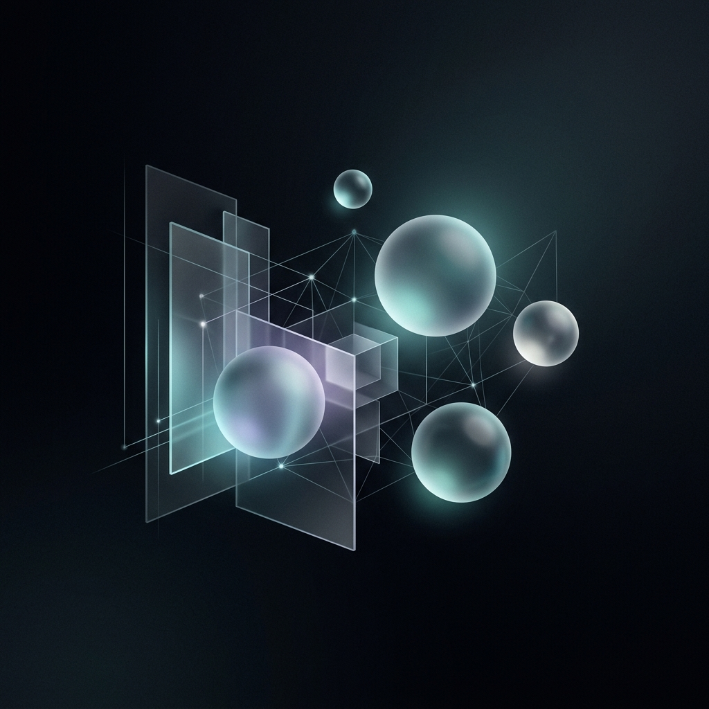

<div align="center">
  
</div>

<br />

<div align="center">
  <h1> VEER PRATAP SINGH </h1>
  <p><b> SYSTEMS ENGINEER & DESIGNER </b></p>
  <p> <i> "Built different. Calm about it." </i> </p>
</div>

<br />

<div align="center">
  <a href="https://veerpratapsingh.vercel.app"></a>
  &nbsp;
  <a href="mailto:veerpratap3007@gmail.com"></a>
</div>

<br />

---

### `> whoami`

```ts
/** 
 *  @role    Systems Engineer, Full Stack Developer, Hardware Enthusiast
 *  @focus   Web Architecture • Embedded Systems • UI/UX • AI
 *  @status  Currently building a combat robot & an ESP-based drone
 */

const veer = {
  stack: ["TypeScript", "Python", "C++", "Next.js", "Framer Motion", "Embedded C"],
  interests: ["Robotics", "Fast Cars", "Boxing", "Guitar", "Minimal Aesthetics"],
  objective: "Build real-world systems at the intersection of software, hardware, and design."
};
```

---

<br />

<div align="center">
  <table>
    <tr>
      <td align="center" width="50%">
        <b> ⚡ RECENT ACTIVITY </b><br/><br/>
        
      </td>
      <td align="center" width="50%">
        <b> 🛠 CORE ARSENAL </b><br/><br/>
        <br/><br/>
        <br/><br/>
        
      </td>
    </tr>
  </table>
</div>

<div align="center">
  <table>
    <tr>
      <td align="center" width="50%">
        <b> 📊 GITHUB STATS </b><br/><br/>
        
      </td>
      <td align="center" width="50%">
        <b> 🔥 COMMIT STREAK </b><br/><br/>
        
      </td>
    </tr>
  </table>
</div>

<br />

---

<div align="center">
  <b> 🐍 CONTRIBUTION SNAKE </b><br/><br/>
  
</div>

<br />

<div align="center">
  <p><sub> <i> precision • power • aesthetics </i> </sub></p>
</div>
