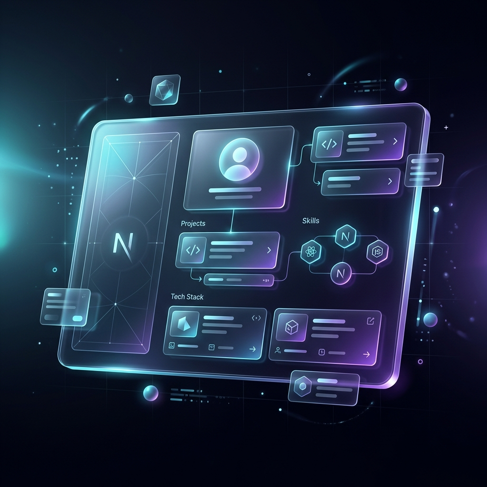
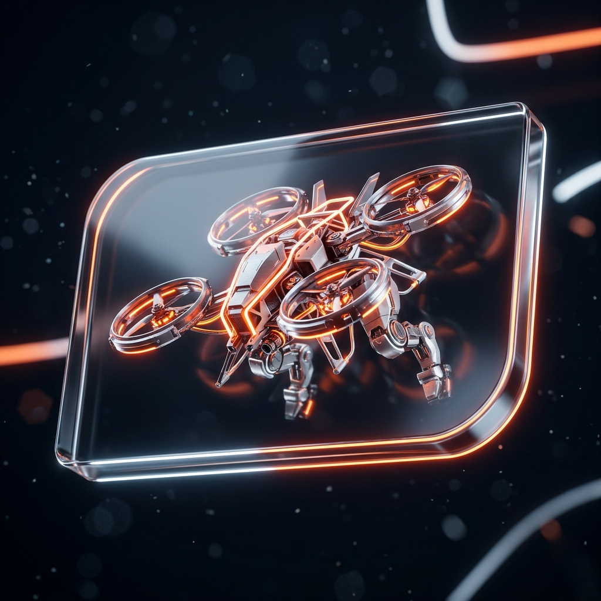

<div align="center">
  
</div>

<br />

<div align="center">
  <h1> VEER PRATAP SINGH </h1>
  <p><b> SYSTEMS ENGINEER & DESIGNER </b></p>
  <p> <i> "Built different. Calm about it." </i> </p>
</div>

<br />

<div align="center">
  <a href="https://veerpratapsingh.vercel.app"></a>
  &nbsp;
  <a href="mailto:veerpratap3007@gmail.com"></a>
</div>

<br />

---

### `[ ACTIVE_DIRECTIVES ]`

```text
ID  | CLASSIFICATION         | STATUS        | PRIMARY TECHNOLOGIES
----|------------------------|---------------|----------------------------------
001 | Combat Robotics        | [IN PROGRESS] | Embedded C, Motor Control, CAD
002 | Autonomous ESP Drone   | [IN PROGRESS] | ESP32, PID Tuning, C++
003 | Full Stack Portfolio   | [DEPLOYED]    | Next.js, React, Tailwind, Vercel
004 | Machine Learning Core  | [PLANNING]    | Python, TensorFlow, PyTorch
```

<br />

### `[ SYSTEM_ARCHITECTURE ]`

```text
                      [USER_INPUT: CHALLENGE]
                                │
                                ▼
  ┌───────────────────────────────────────────────────────────┐
  │                 NEURAL_PROCESSING_UNIT                    │
  │                                                           │
  │  [IDEATION] ──▶ [PROTOTYPING] ──▶ [OPTIMIZATION_LOOP]     │
  └───────────────────────────────────────────────────────────┘
                                │
          ┌─────────────────────┴─────────────────────┐
          ▼                                           ▼
[HARDWARE_INTERFACE]                         [SOFTWARE_INTERFACE]
  - ESP32 / Arduino                            - Next.js / React
  - Combat Robotics                            - TypeScript / Node
  - Motor Controllers                          - ML / Python
          │                                           │
          └─────────────────────┬─────────────────────┘
                                ▼
                       [OUTPUT: EXECUTION]
```

<br />

### `[ CORE_COMPETENCIES ]`

```text
[LANGUAGES]    :: TypeScript, Python, C++, Java, JavaScript, C
[FRAMEWORKS]   :: Next.js, React, TailwindCSS, Framer Motion, Node.js
[HARDWARE]     :: ESP32, Raspberry Pi, Arduino, Embedded C, Motor Controllers
[DATA_OPS]     :: TensorFlow, Pandas, NumPy, OpenCV
```

<br />

---

### `[ FEATURED_MODULES ]`

<div align="center">
  <table>
    <tr>
      <td align="center" width="50%">
        <a href="https://github.com/Veerpratapsingh08/porfolio">
          
        </a>
        <br/><br/>
        <b><a href="https://github.com/Veerpratapsingh08/porfolio">SYS // PORTFOLIO</a></b>
        <p>Next.js / TypeScript / Tailwind</p>
      </td>
      <td align="center" width="50%">
        <a href="#">
          
        </a>
        <br/><br/>
        <b><a href="#">SYS // ROBOTICS</a></b>
        <p>ESP32 / Embedded C / Kinematics</p>
      </td>
    </tr>
  </table>
</div>

<br />

---

### `[ TELEMETRY_METRICS ]`

<div align="center">
  <table>
    <tr>
      <td align="center" width="50%">
        <b> ⚡ ACTIVITY LOG </b><br/><br/>
        
      </td>
      <td align="center" width="50%">
        <b> 🔥 COMMIT CONSISTENCY </b><br/><br/>
        
      </td>
    </tr>
  </table>
</div>

<br />

---

### `[ CONTRIBUTION_GRID ]`

<div align="center">
  
</div>

<br />

<div align="center">
  <p><sub> <i> precision • architecture • execution </i> </sub></p>
</div>
